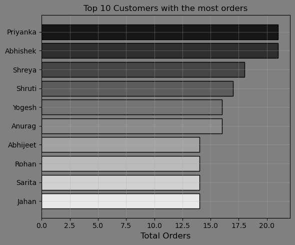
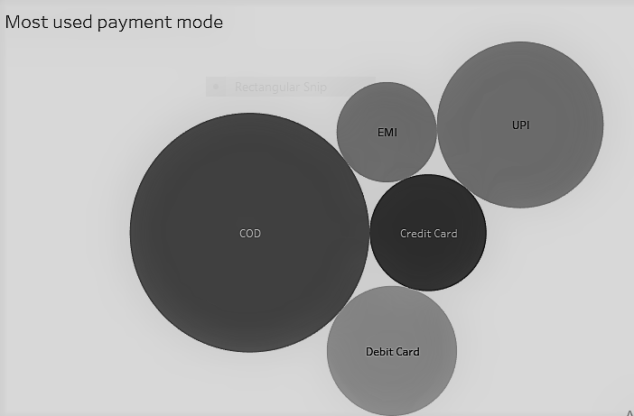
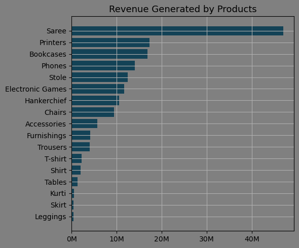
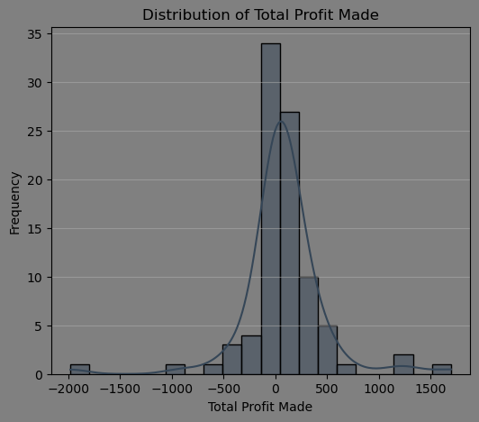
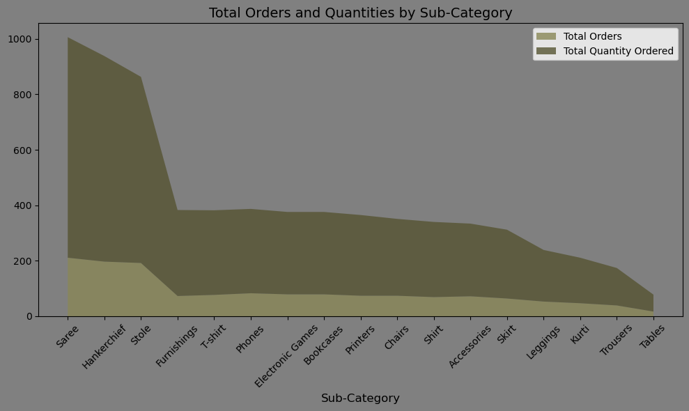
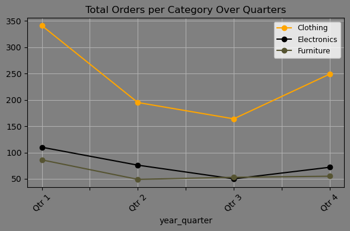

## **📖 Introduction**
📊 This project is focused on analyzing the data of an online retail store to gain actionable insights. The analysis explores customer segmentation, revenue trends📉, and inventory management to uncover opportunities for improving business performance and decision-making. 

SQL queries? check them out here: [SQL_queries folder](/SQL_queries/)

## **🌍 Background**
- E-commerce is a booming industry with vast amounts of data generated daily. To stay competitive, businesses need to understand customer behavior, optimize inventory, and drive revenue growth. This project leverages a dataset representing an online retail store 🛍️ to address these challenges.

## **🛠 Tools I Used**
For my deep dive into the E-commerce Analytics, I harnessed the power of several tools:
- **🛢️ SQL:** The backbone of my analysis, allowing me to query the database and unearth critical insights.

- **Postgresql:** The choosen database management system, ideal for handling the E-commerce data.
- **Visual Studio Code:** My go-to for advanced data visualizations(Matplotlib, seaborn, pandas)
- **Git & Github:** Essential for version control and sharing my scripts and analysis, ensuring collaboration and project tracking

- **📊 Excel:** For quick data exploration.

- **Chatgpt:** Used for repetitive tasks

## **The Analysis 🔍**
Each query in this project aimed at analyzing key aspects of the online retail store's data and addressing critical questions related to the challenges faced by e-commerce businesses.
Here's my approach:

### **Customer Segmentation**

### 1. Customers who made the most orders
To identify the customers with the highest number of orders. I limited the results to the top 10 customers. 
This query highlights the customers with the most orders.

```sql
WITH customer_orders AS (
    SELECT 
        Order_ID, Customer_Name
    FROM orders
    JOIN Details 
    ON orders.Order_ID = Details.Order_ID
)
SELECT 
    DISTINCT(Customer_Name) AS Customer_Name, 
    COUNT(Order_ID) AS total_order
FROM customer_orders
GROUP BY Customer_Name
ORDER BY total_order DESC
LIMIT 10;
```


*This visualization is an horizontal bar chart displaying the  top 10 customers with the highest orders. this chart was generated with python*

**Insight**:
- This analysis highlights that while a few customers (e.g., Abhishek and Priyanka) have exceptionally high orders, a significant number of customers place orders closer to the average, with a cluster around 13–14 orders.


### 2. Customers who spent the most amount of money
To identify the customers with the highest amount of money spent. I limited the results to the top 10 customers. 
This query highlights the customers with the most amount of money spent.

```sql
WITH customer_orders AS (
    SELECT 
        Customer_Name, Amount 
	FROM Orders
	JOIN Details 
	ON orders.Order_ID = Details.Order_ID
)
SELECT 
    DISTINCT(Customer_Name) as Customer_Name,
    SUM(Amount) as total_amount_spent
FROM customer_orders
GROUP BY Customer_Name
ORDER BY total_amount_spent desc
LIMIT 10;
```
| **Customer_Name** | **Total_amount_spent** |
|-----------------------|-------------------------|
| Harivansh                    | 9902                       |
|Madhav                    | 9365                      |
| Madan Mohan                    | 7766                       |
| Shiva                   | 6339                       |
| Vishakha                   | 6120                       |
| Vrinda                   | 5820                      |
| Lalita                   | 5809                       |
*Highlighted result from the query*

### **Key Insights:**
 -
    **Top Spenders:**
        Harivansh spent the most, with ₹9,902, closely followed by Madhav at ₹9,365.

    **Spending Clusters:**
        Most customers fall between ₹6,000 and ₹7,000, with only two spending above ₹9,000.

    **Significant Gap:**
        There’s a noticeable gap of above ₹5,000 between the highest spender (Harivansh) and the lowest spenders.

### 3. Most used Payment mode
To identify the most used Payment mode. 
This query highlights the most used payment mode.

```sql
WITH customer_orders AS (
    SELECT 
        Order_ID, Payment_Mode
	FROM Orders
	JOIN Details 
	ON orders.Order_ID = Details.Order_ID
)
SELECT
    Payment_Mode, 
    count(Order_ID) as "Total times used for payment"  
FROM customer_orders
GROUP BY Payment_Mode
ORDER BY "Total times used for payment" desc
```


*A bubble chart displaying the most used payment modes. Each bubble represents a specific payment method, and its size correlates with the popularity or usage level of that payment mode.*

**Insights:**

#### Breakdown:
-
    COD (Cash on Delivery):
        The largest bubble in the chart, indicating it is the most preferred or used payment method among users.

-   UPI (Unified Payments Interface):
        The second-largest bubble, showing high adoption and popularity among users for seamless digital payments.

 -   Credit Card:
        Slightly smaller than UPI, indicating that a significant number of users also rely on credit cards for transactions.

 -   Debit Card:
        Smaller than credit card usage but still relevant as a preferred payment option.

  -  EMI (Equated Monthly Installments):
        The smallest bubble among the options, indicating that EMI is the least commonly used payment mode compared to others.

### Analysis:

 -   **Popularity of COD:**
        The dominance of COD may suggest user preference for cash transactions due to trust issues with online payments or lack of access to digital payment methods.
    

 -   **Rise of UPI:**
        The large bubble for UPI highlights the growing adoption of digital wallets and real-time bank-to-bank transfer systems by customers.
    
  -  **Credit vs Debit Cards:**
        Credit card usage appears higher than debit cards, which may reflect consumer preference for rewards, offers, or the ability to defer payments.
        Debit cards, while widely available, may not provide the same incentives or credit flexibility, leading to comparatively lesser use by customers.

  -  **EMI's Smaller Share:**
        EMI being the smallest bubble could indicate that customers prefer to pay upfront rather than opt for installment-based plans, possibly due to the interest rates or limited availability of EMI options.

### 4. Average Quantity Ordered by Customers 
To identify the average quantity of products ordered by customers. 
This query highlights the average quantity of products ordered by customers.
```sql
 WITH customer_orders AS (
    SELECT 
        Customer_Name, Quantity
         
	FROM Orders
	JOIN Details 
	ON orders.Order_ID = Details.Order_ID
)
SELECT 
    DISTINCT(Customer_Name) as Customer_Name,  
	ROUND(AVG(Quantity), 0) as average_quantity_purchased
FROM customer_orders
GROUP BY Customer_Name
ORDER BY average_quantity_purchased desc
```
| **Customer_Name** | **Average_quantity_purchased** |
|-----------------------|-------------------------|
| Arti                    | 9                       |
| Divyansha                    | 9                       |
| Nirja                    | 9                       |
| Suhani                    | 9                       |
| Utkarsh                    | 9                       |
| Akash                    | 8                      |
| Inderpreet                    | 8                       |
*Highlighted result from the query*

### 5. Customers frequency of purchase 
To identify customers frequency of purchase.
I showed the total orders they made compared to the overall monthly orders. 
This query highlights customers frequency of purchase.
```sql

 WITH customer_orders AS (
    SELECT 
        Order_ID, Order_Date, Customer_Name
	FROM Orders
	JOIN Details 
	ON orders.Order_ID = Details.Order_ID
)
SELECT 
    Customer_Name,
    TO_CHAR(Order_Date, 'Month') AS "Month_orders_were_made", 
    COUNT(Order_ID) AS "Total_orders_made",
    SUM(COUNT(Order_ID)) OVER (PARTITION BY TO_CHAR(Order_Date, 'Month')) AS Total_monthly_orders
FROM customer_orders
GROUP BY 
    TO_CHAR(Order_Date, 'Month'), 
    Customer_Name, Order_Date
ORDER BY 
    Customer_Name,
    Extract(month from Order_Date)
LIMIT 25;
```
| Customer_Name | Month_orders_were_made | Total_orders_made | Total_monthly_orders |
|---------------|-------------------------|-------------------|-----------------------|
| Aakanksha     | July                   | 2                 | 64                    |
| Aarushi       | February               | 2                 | 140                   |
| Aarushi       | March                  | 6                 | 205                   |
| Aarushi       | April                  | 4                 | 101                   |
| Aastha        | October                | 6                 | 106                   |
| Aayush        | November               | 6                 | 159                   |
| Aayushi       | January                | 3                 | 192                   |
| Aayushi       | June                   | 1                 | 101                   |
| Aayushi       | September              | 1                 | 83                    |
*Highlighted result from the query*

**Insights:**

-    **Top Performer (Customer with Most Orders in a Single Month):**
       Customers like Priyanka and Vishakha, have placed more than 9 orders with a total of over 115 monthly orders

  -  **Customer Activity Patterns:**
        Aarushi and similar customers are the most active customers, making orders across three consecutive months.
        Aayushi and similar customers are less consistent customers, making orders in non-consecutive months.

  -  **Months with Highest Activity:**
        March and January have the highest activity

  -  **Months with Lowest Activity:**
        September and June have the least activity

  -  **Insights on Customer Engagement:**
        Customers like Aarushi, Priyanka, Vishakha, Aayush and similar customers appear more engaged, contributing a significant number of orders during active months.
        Customers such as Aakanksha, Aayushi and similar customers have fewer orders and lower engagement.

  -  **Monthly Trends:**
        Peak Performance Months: March, January, and November stand out for having the highest total orders.

        Lulls in Activity: July and September indicate lower activity

### **Revenue Analysis** 

### 1. Revenue generated by products sub_category
To identify the total revenue generated by sub_category products. 
This query highlights sub_category products with the corresponding revenue generated.
```sql
WITH customer_orders AS (
    SELECT 
        Sub_Category, Amount, Quantity 
	FROM Orders
	JOIN Details 
	ON orders.Order_ID = Details.Order_ID
)
SELECT 
    Sub_Category,
    SUM(Quantity) * SUM(Amount) as total_revenue_generated
FROM customer_orders
GROUP BY Sub_Category
ORDER BY total_revenue_generated desc
```

*A bar chart displaying the total revenue generated by sub_category products. Each bar represents a specific product, and its length correlates with the total amount of revenue generated.*

**Insights:**

- **Top-Performing Products:**

    Saree leads by a significant margin, generating the highest revenue among all categories. This dominance suggests a strong market demand, possibly driven by cultural significance, consistent quality, or competitive pricing.
    Printers and Bookcases follow in second and third positions, respectively. These products may cater to professional or educational markets, indicating their utility-driven appeal.

- **Mid-Tier Performers:**

    Categories such as Phones, Stole, and Electronic Games show moderate revenue contributions. These might represent a mix of steady demand with potentially higher margins or market saturation.
    Handkerchief and Chairs also maintain a respectable standing, reflecting niche or functional usage patterns.

- **Low Revenue Contributors:**

    Products like Skirt, Kurti, and Leggings show minimal revenue, potentially indicating limited demand, poor positioning, or competition from alternative brands or products.
    Tables and Shirt also contribute less, hinting at potential inefficiencies in these product segments.

- **Possible Trends:**

    The clear dominance of Saree suggests a skewed revenue distribution, likely emphasizing the importance of this product in driving overall profitability.
    Low performance in categories such as Skirt and Leggings may warrant a deeper review of market trends, customer preferences, or inventory strategies.

### 2.Profit made from sub_category products
To identify the sub_category products that generated the most profit for the retail store.
this query highlights this:
```sql
 WITH customer_orders AS (
    SELECT 
        Sub_Category, Profit 
	FROM Orders
	JOIN Details 
	ON orders.Order_ID = Details.Order_ID
)
SELECT 
    Sub_Category, 
    SUM("Profit") as sum_Profit_made
FROM customer_orders
GROUP BY Sub_Category
ORDER BY total_Profit_made desc
```
| **Sub_Category** | **Sum_Profit_made** |
|-----------------------|-------------------------|
| Printers                    | 8606                       |
|Bookcases                    | 6516                      |
| Saree                    | 4057                       |
| Accessories                   | 3353                       |
| Tables                   | 3139                       |
| Trousers                   | 2847                      |
| stole                   | 2431                       |
*Highlighted result for the query*

**Insights:**
- **Mean Profit:** ₹180,064
- **Profit Range:** From ₹-66,998 (loss) to ₹714,298.
- **Standard Deviation:** ₹210,574
- **Median Profit:** ₹151,409
- **First Quartile:** ₹-10,790
- **Third Quartile:** ₹260,537


### 3. Average quantity ordered by customers with profit made.
To identify the Average quantity of Products ordered and the corresponding profit made.
I filtered the average quantity purchased to purchases greater than 5.
Here is the query and analysis.
```sql
 WITH customer_orders AS (
    SELECT 
        Customer_Name, Category,
        Quantity, Profit 
	FROM Orders
	JOIN Details 
	ON orders.Order_ID = Details.Order_ID
)
SELECT
    Customer_Name, Category, 
    ROUND(AVG(Quantity), 0) as Average_quantity_purchased, 
    SUM(Profit) as Total_profit_made
FROM customer_orders
GROUP BY Category, Customer_Name, Profit
HAVING ROUND(AVG("Quantity"), 0) > 5
ORDER BY Category, Average_quantity_purchased desc
LIMIT 25;
```

*Bar chart showing average quantity purchased and total profit made by product category*

**key insights:**

 -   Distribution of Total Profit Made:
        The profit distribution shows a wide range, including negative values, indicating some transactions resulted in losses.
        Most profits are clustered around zero, with fewer high-profit entries.
        

  -  **Average Quantity Purchased Per Product Category:**
        Electronics has the highest average quantity purchased.
        Clothing and Furniture follow, with slightly lower average quantities.

  -  **Total Profit Made Per Product Category:**
        Electronics generates the highest total profit, followed by Furniture.
        Clothing has the lowest total profit, suggesting either lower sales volume or profitability.

 -   **Correlation Analysis:**
        There is a weak negative correlation (-0.084) between average quantity purchased and total profit made. This suggests that higher quantities do not necessarily lead to higher profits.

### 4. Revenue generated by states
To identify the total revenue made by states from product category.
query and analysis:
```sql
WITH customer_orders AS (
    SELECT 
        State, Category,
        Amount, Quantity  
	FROM Orders
	JOIN Details 
	ON orders.Order_ID = Details.Order_ID
)
SELECT 
    State, Category, 
    SUM(Quantity) * SUM(Amount) as Sum_revenue_generated
FROM customer_orders
GROUP BY State, Category
ORDER BY State, Sum_revenue_generated desc;
```
| State             | Category    |   total_revenue_generated |
|:------------------|:------------|--------------------------:|
| Andhra Pradesh    | Clothing    |                    278984 |
| Andhra Pradesh    | Electronics |                    126140 |
| Andhra Pradesh    | Furniture   |                    176224 |
| Bihar             | Clothing    |                    412440 |
| Bihar             | Electronics |                    492919 |
| Bihar             | Furniture   |                     49837 |
| Delhi             | Clothing    |                   1236760 |
| Delhi             | Electronics |                    178885 |
| Delhi             | Furniture   |                    680624 |
*Highlighted result of the query*

**Insights:**
- **Top-Performing States**

     **Overall Revenue:**
        Madhya Pradesh generated the highest overall revenue, with Clothing contributing significantly (₹23,942,106).
        Maharashtra follows closely, with a diversified contribution across categories, especially Electronics (₹12,902,937).

 -  **Category-Wise Top Performers**

    ***Clothing:*** Madhya Pradesh (₹23,942,106).

    ***Electronics:*** Maharashtra (₹12,902,937).

    ***Furniture:*** Madhya Pradesh (₹5,104,879).

- **Category Insights**

   ***Clothing:***
        The largest revenue contributor across most states.
        High contributions in states like Gujarat, Delhi, and Uttar Pradesh indicate strong demand.

   ***Electronics:***
        Significant revenue in Maharashtra, Madhya Pradesh, and Uttar Pradesh.
        States like Goa and Sikkim have relatively low Electronics revenue, indicating potential market opportunities.

   ***Furniture:***
        While contributing less compared to the other categories, Furniture still shows significant revenue in Maharashtra and Delhi.

- **State-Level Trends**

   ***Diverse Performers:***
        States like Madhya Pradesh and Maharashtra generate substantial revenue across all categories.
        Delhi also shows balanced contributions, particularly in Clothing and Furniture.

   ***Category-Specific Focus:***
        Bihar: Stronger focus on Clothing and Electronics.
        Goa: Primarily reliant on Clothing.

- **Opportunities**

   ***Underperforming States:***
        States like Sikkim, Nagaland, and Tamil Nadu have low contributions across all categories, indicating potential for market growth.

   ***Untapped Potential:***
        Electronics has scope for growth in smaller states (e.g., Goa, Sikkim).
        Furniture could be explored further in states with low revenue in this category.

- **Key Takeaways**

   Madhya Pradesh dominates in total revenue generation, especially in Clothing.
    Maharashtra leads in Electronics, indicating a strong tech or appliance market.
    Some smaller states like Sikkim and Nagaland show lower revenue, signaling growth opportunities for businesses.

### **Inventory Management**
### 1. Total orders made with corresponding quantity ordered
To identify the total orders made from Product sub_category.

query and analysis:
```sql
WITH customer_orders AS (
    SELECT 
        Order_ID, Sub_Category,
        Quantity
	FROM Orders
	JOIN Details 
	ON Orders.Order_ID = Details.Order_ID
)
SELECT 
    Sub_Category, COUNT(Order_ID) as total_orders, 
    SUM(Quantity) as total_quantity_orderd
FROM customer_orders
GROUP BY Sub_Category
ORDER BY total_orders desc
```


**Insights:**
- **Comparison of Total Orders and Quantities:**

    The stack plot illustrates the cumulative values of total orders and quantities ordered across different sub-categories.
    Some sub-categories, like "Saree" and "Hankerchief," exhibit high values in both total orders and quantities, dominating the dataset.

- **Relative Contributions:**

    The difference between the layers of the stack highlights the disparity between the total orders and the total quantity ordered for each sub-category.

- **Sub-category Insights:**

    Sub_categories with larger stack segments (e.g., "Saree") have both higher demand in terms of orders and higher quantities ordered, suggesting popularity or frequent bulk purchasing.

### 2. Total orders by year quarters
To identify the total orders made by year quarter, I extracted the months from the order date and grouped it into quarters. 
Here's the query and analysis:
```sql
WITH customer_orders AS (
    SELECT 
        Order_ID, Order_Date, Category
	FROM Orders
	JOIN Details 
	ON orders.Order_ID = Details.Order_ID
),
customer_orders_quarter AS (
    SELECT 
        Category
        EXTRACT(QUARTER FROM Order_Date) AS year_quarter,
        COUNT(Order_ID AS total_orders
    FROM customer_orders
    GROUP BY Category EXTRACT(QUARTER FROM Order_Date)
),
final_totals AS (
    SELECT 
        CASE EXTRACT(QUARTER FROM Order_Date)
            WHEN 1 THEN 'Qtr 1'
            WHEN 2 THEN 'Qtr 2'
            WHEN 3 THEN 'Qtr 3'
            WHEN 4 THEN 'Qtr 4'
        END AS year_quarter,
        Category
        COUNT(Order_ID AS total_orders
    FROM customer_orders
    GROUP BY Category EXTRACT(QUARTER FROM Order_Date)
)
SELECT 
    year_quarter, Category
    SUM(total_orders) AS total_orders
FROM final_totals
GROUP BY year_quarter, Category
ORDER BY year_quarter, total_orders DESC;
```

*Line chart displaying the total orders made over year quarters*

**Insights:**

  -  **Quarterly Total Orders (All Categories):**
     -  Qtr 1 had the highest total orders across all categories (537 orders).
        Orders declined in Qtr 2 (320 orders) and further in Qtr 3 (267 orders).
        Qtr 4 showed a recovery with 376 orders.

   - **Category Trends:**
      -  ***Clothing:***
            Consistently outperformed other categories across all quarters.
            Peaked in Qtr 1 with 341 orders but saw a sharp decline in Qtr 2 (195 orders) and Qtr 3 (164 orders), followed by a recovery in Qtr 4 (249 orders).
       - ***Electronics:***
            Showed moderate performance, with a peak in Qtr 1 (110 orders).
            Experienced a steady decline through Qtr 2 (76 orders) and Qtr 3 (50 orders), with slight growth in Qtr 4 (72 orders).
      -  ***Furniture:***
            Had the lowest orders across all quarters.
            Orders were relatively stable but showed a slight improvement from Qtr 3 (53 orders) to Qtr 4 (55 orders).

  -  **Seasonal Trends:**

      -  Qtr 1 consistently performs better across all categories, indicating potential seasonal factors driving higher demand (e.g., new year sales or seasonal promotions).
        Qtr 3 represents a low point across categories, suggesting a possible lull in demand during this period.

## **📚 What I Learned**
### **Tools:** 
- Throughout this project, I honed my expertise in advanced SQL techniques, including table merging, WITH clauses, CTEs, aggregate functions, CASE statements, etc, enabling me to write more efficient and complex queries.  

- This project enhanced my real-world problem-solving skills by applying SQL to address challenges faced by e-commerce businesses. I transformed curiosity and challenges into actionable insights through well-crafted SQL queries.
### **Customer Insights** 
- #### During this project, I learned how to segment customers effectively to target marketing strategies and improve sales.

### **Revenue Patterns** 
- #### I learned to Understand seasonal trends and identify high-performing products.

### **Inventory Optimization**
- #### I learned the Importance of balancing stock levels to meet demand without overstocking.

## **💡 Recommendations**
### **Payment Mode**
- COD processes should be optimized as it remains the most dominant payment mode.
- Investing in promoting digital payments,
 especially UPI, will help to reduce dependency on COD and lower operational risks related to cash handling.

### **customer purchase frequency**
**Targeted Promotions:**
- Focusing on low-activity months like June and September will boost engagement.

-    Encouraging customers like Aakanksha and Aayushi to make more frequent purchases through discounts or personalized offers will increase retention.

 **Engage Top Customers:**
  -  Rewarding active customers like Aarushi and Aayush will maintain their loyalty and increase their spending.

**Seasonal Analysis:**
- Further investigations can be made to determine if seasonal trends (e.g., holidays, sales events) drive the high numbers in months like March and November.

 **Customer Retention Strategy:**
- Using loyalty programs or subscription models will convert less consistent customers into regular buyers.

### **Revenue generation**

**Investment and Focus:**
 - marketing, supply chain optimization, and product development should be focused on top-performing categories like Saree, Printers, and Bookcases to maximize ROI.

**Performance Improvement:**
- For low-performing products, customer feedback should be analyzed, pricing strategies should be adjusted, or offerings should be repositioned to enhance visibility and sales.

- For top-performing products, market research should be conducted to replicate their success factors across other categories.

**Diversification:**
- To mitigate risk, mid-tier product categories like Phones and Stole should be strengthened for more balanced revenue streams.

### **Inventory Management:**
- Inventory risks should be reduced for low-demand items and reinvested in best-sellers.

### **Promotional Campaigns:**
- Awareness should be raised for underperforming but high-potential products (e.g., Kurti, Leggings)

- Advertising efforts should be increased during peak sales periods.

## 🏁 Conclusion  
This project highlighted the transformative potential of effective SQL query analysis in optimizing business operations and driving strategic decision-making. By leveraging advanced SQL techniques, I gained deeper insights into the key performance metrics of the online retail store, enabling the identification of actionable strategies to enhance customer satisfaction, increase revenue, and improve inventory management. Additionally, this experience significantly enriched my SQL skill set, equipping me with the analytical tools and technical expertise to address complex, real-world challenges faced by businesses in the e-commerce domain. Overall, this project underscored the critical role of data-driven insights in fostering business growth and operational excellence.

## 🔗 References

#### **Dataset:** 
The dataset used for this project was gotten from an online retail store🛍️ in india.
check it out here 
[csv_file](csv_Files)


```
Thank you for exploring 🚀
```
 
